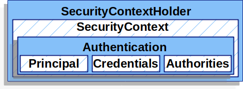

# Spring security

https://docs.spring.io/spring-security/reference/servlet/authorization/architecture.html

# DelegatingFilterProxy
DelegatingFilterProxy - фильтр, связывающий контекст контейнера сервлетов и контекст Spring
Основная задача - извлечь из контекста spring бины-фильтры и пропустить через них запрос

Для удобства контроля фильтры удобнее регистрировать в контексте spring

```java
@Configuration
@EnableWebSecurity
public class SecurityConfig {

    @Bean
    public SecurityFilterChain filterChain(HttpSecurity http) throws Exception {
        http
            .csrf(Customizer.withDefaults())
            .httpBasic(Customizer.withDefaults())
            .formLogin(Customizer.withDefaults())
            .authorizeHttpRequests(authorize -> authorize
                .anyRequest().authenticated()
            );

        return http.build();
    }

}
```

## Аутентификация 
https://docs.spring.io/spring-security/reference/servlet/authentication/architecture.html

Основные объекты процесса аутентификации (описаны интерфейсами):
- `SecurityContextHolder` - хранилище сведений об аутентифицированных пользователях
- `SecurityContext` - доступен из `SecurityContextHolder`, и содержит объект аутентификации (`Authentication`) текущего
аутентифицированного пользователя
- `Authentication` - выступает в двух ролях: (1) как объект (токен), содержащий сведения для аутентификации (передается 
аргументом в метод AuthenticationManager.authenticate); (2) после аутентификации содержит сведения о пользователе




## Авторизация

AuthorizationManager


## На уровне методов

@EnableMethodSecurity

```java
@Service
public class MyCustomerService {
    @PreAuthorize("hasAuthority('permission:read')")
    @PostAuthorize("returnObject.owner == authentication.name")
    public Customer readCustomer(String id) { ... }
}
```

Аннотация `@PreAuthorize("hasRole('ADMIN')")` будет проверять имеет ли пользователь роль `ROLE_ADMIN`.

Префикс `ROLE_` используется по умолчанию. Поведение можно изменить:
```java
    @Bean
    static GrantedAuthorityDefaults grantedAuthorityDefaults() {
        return new GrantedAuthorityDefaults("ROLE_");
    }
```

```java
@Component
public class BankService {
	@PreAuthorize("hasRole('ADMIN')")
	public Account readAccount(Long id) {
        // ... is only invoked if the `Authentication` has the `ROLE_ADMIN` authority
	}
}
```


    @PreAuthorize("hasRole('ROLE_ADMIN')")
    @Bean
    static GrantedAuthorityDefaults grantedAuthorityDefaults() {
        return new GrantedAuthorityDefaults("ROLE_");
    }

